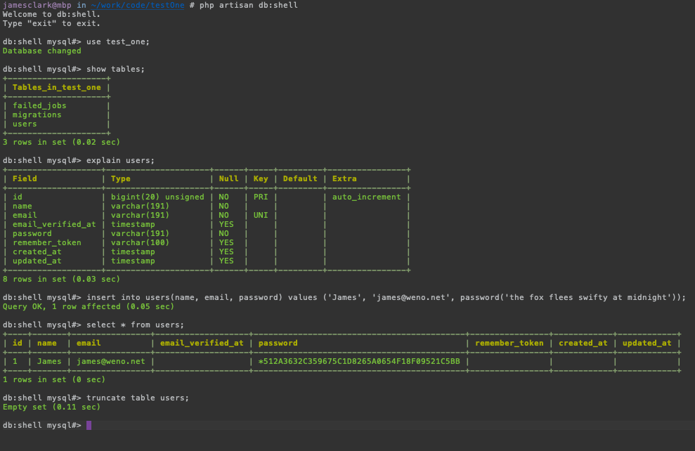
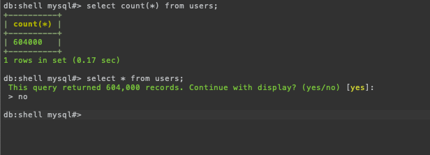

## Table of Contents
- [Introduction](#introduction) 
- [Why](#why) 
- [Installation](#installation)
- [Configuration](#configuration)
- [Usage](#usage)
- [Value Added](#value-added)
- [CHANGELOG](#changelog)
- [Drop me a line](#drop-me-a-line)

## Introduction
DbShell adds an artisan command to your Laravel application which mimics the mysql command line client.

This allows you to interact with the database in a simplistic CLI interface using direct SQL statements.




## Why?
In short, to avoid installing software on the host machine which is otherwise not needed.

Refer to the [why documentation](documentation/why.md) if you are interested in more details about the motivation for this package.


## Installation
Installing db-shell is a straightforward matter using standard composer commands. 

```shell
composer require Jamesclark32/db-shell
```
You may wish to include the package only in developement environments, and prevent it's inclusion on production environments. In this case, replace `require` with `require-dev`

## Configuration
If you want to fine-tune the configuration, colors, or language file you will need to publish them by running:

```shell
php artisan vendor:publish --provider="Jamesclark32\DbShell\DbShellServiceProvider"
```

This will copy files to your project:
```
config/db-shell.php
language/vendor/db-shell/
``` 
 
 You can modify these files as you see fit. Refer to the  [configuration documentation](documentation/configuration.md) for details on fine-tuning your installation.

## Usage
Once installed, you can launch the db-shell interface via:

```shell
php artisan db-shell
```

This will start a long-running process which will allow you to directly input sql queries and see the results.

For the most part, this will behave like the mysql cli client.

You can exit the interface at any time by typing `exit`. 

## Value Added
When compared to using the traditional MySQL CLI client, db-shell offers a few small niceties. 

1. Colorized output.
2. Automatic switching between tabular and vertical output based on terminal width of result set size
3. Display verification for very large result sets.



## Changelog
Please see [CHANGELOG](CHANGELOG.md) for more information what has changed recently.

## Drop me a line
If you're using this package, I'd love to hear your thoughts about it at [james@weno.net](mailto:james@weno.net)!